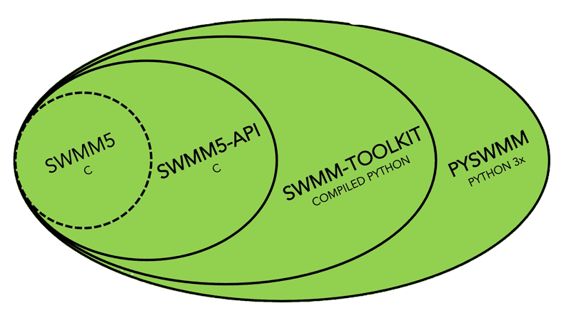

# Steps to Build SWMM and PySWMM

Author: Constantine Karos and Bryant McDonnell

Date: May 16, 2023

Version: 1

## Summary

PySWMM versions are built and released with a multi-step workflow and requires several tools and GitHub repositories.  PySWMM has a layered architecture where C and Python are used.  The core is SWMM which is outfitted with an extended API.  Using a tool called SWIG (Simple Wrapper Interface Generator), "typemaps" are used to clearly insert the required Python-C code (since Python is written in C) to the build and compile the library.  In the final layer, PySWMM abstracts away the "C" feel and makes it Pythonic by implementing an object-oriented paradigm.  See the following Figure.  The project is organized into several repositories on GitHub.  They span from the raw-codebases, the build process, to the testing systems.  

## Requirements and Resources

##### Machine Requirements

- 

##### Software Requirements

- 

## High-level Steps

##### SWMM/SWMM-API

1. Install all required software
2. Clone the SWMM repo
3. Clone the ci-tools
4. Make your changes to SWMM (optional)
5. Adding Unit Tests
6. Building SWMM
7. Running Regression Tests

##### SWMM-TOOLKIT

1. Clone the SWMM-Python repo
2. Modify (as required) the interfacing files
3. Build Wheel (Will compile SWMM here)

##### PySWMM

1. Clone the PySWMM repo
2. Modify (as required)
3. Adding Unit tests
4. Build

### SWMM/SWMM-API Build Steps

### SWMM-TOOLKIT

### PySWMM

